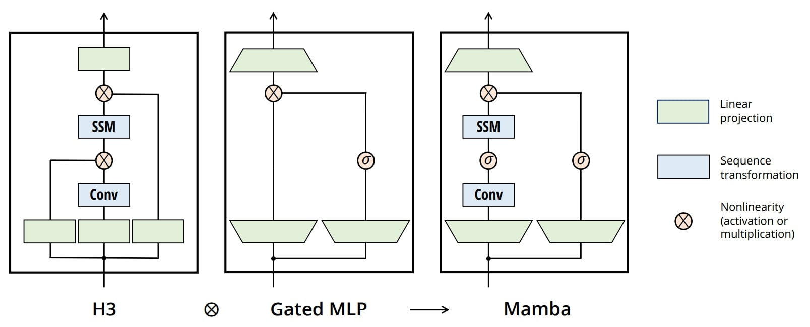

# Stock Movement Prediction Using Mamba And Ensemble Learning  

<p align="center"><strong>Mamba Architecture</strong></p>
<p align="center">
  
</p>

## Paper:
[https://ieeexplore.ieee.org/abstract/document/10825870](https://ieeexplore.ieee.org/abstract/document/10825870)

## Citation

If you use this code in your research, please cite our paper:

```bibtex

@inproceedings{akgun2024stock,
  title={Stock Movement Prediction Using Mamba And Ensemble Learning},
  author={Akg{\"u}n, Halil {\.I}brahim and {\"O}zbayo{\u{g}}lu, Ahmet Murat},
  booktitle={2024 IEEE International Conference on Big Data (BigData)},
  pages={6894--6903},
  year={2024},
  organization={IEEE}
}
